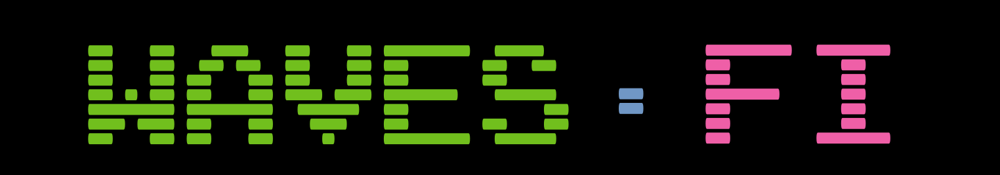

# A Yield Aggregating DeFi DAO

**Waves.Fi** aims to become the first DeFi DAO build on [WAVES](https://waves.tech):

- From the community, for the community
- Launched via "Liquidity Staking"
- Governed by DAO token holders

### WHY?

"DeFi" stands for “decentralized finance” and refers to the ecosystem comprised of financial applications that are being developed on top of blockchain systems. 

The idea behind ***Waves.Fi*** is to develop and operate financial DApps on top of the Waves Protocol. These DApps are written to aggregate yields from the broader DeFi ecosystem (on-chain as well as cross-chain!) and funnel profits back to those staking on the ***Waves.Fi*** node. 

Yielding returns which will far exceed simple Waves staking while at the same time developing and enhancing the ecosystem.

### HOW?

Lorem ipsum dolor sit amet, consetetur sadipscing elitr, sed diam nonumy eirmod tempor invidunt ut labore et dolore magna aliquyam erat, sed diam voluptua. At vero eos et accusam et justo duo dolores et ea rebum. Stet clita kasd gubergren, no sea takimata sanctus est Lorem ipsum dolor sit amet. Lorem ipsum dolor sit amet, consetetur sadipscing elitr, sed diam nonumy eirmod tempor invidunt ut labore et dolore magna aliquyam erat, sed diam voluptua. At vero eos et accusam et justo duo dolores et ea rebum. Stet clita kasd gubergren, no sea takimata sanctus est Lorem ipsum dolor sit amet.

### WHEN?

Development of the DAO contracts will begin as soon as 20k Waves have been generated by the ***Waves.Fi*** node. These 20k Waves will directly fund the initial DAO development.

Once the code is done and reviewed, the DAO will be deployed and all remaining funds generated by the node throughout the ***liquidity staking period*** will be transferred to an address the DAO controls.

From there on out, the DAO token holders can propose and vote what DApps shall be build and funded. We do have some ideas already and plan to propose these as soon as the DAO is operational. You can check them out in the [/roadmap](roadmap).

